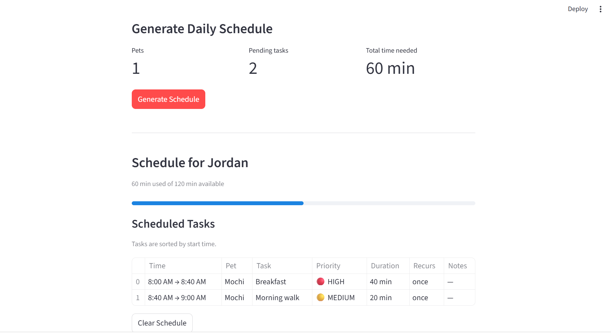

# PawPal+ (Module 2 Project)

You are building **PawPal+**, a Streamlit app that helps a pet owner plan care tasks for their pet.

## Scenario

A busy pet owner needs help staying consistent with pet care. They want an assistant that can:

- Track pet care tasks (walks, feeding, meds, enrichment, grooming, etc.)
- Consider constraints (time available, priority, owner preferences)
- Produce a daily plan and explain why it chose that plan

## What you will build

Your final app should:

- Let a user enter basic owner + pet info
- Let a user add/edit tasks (duration + priority at minimum)
- Generate a daily schedule/plan based on constraints and priorities
- Display the plan clearly (and ideally explain the reasoning)
- Include tests for the most important scheduling behaviors

## Getting started

### Setup

```bash
python -m venv .venv
source .venv/bin/activate  # Windows: .venv\Scripts\activate
pip install -r requirements.txt
```

### Run the app

```bash
streamlit run app.py
```

### Run the terminal demo

```bash
python main.py
```

## Smarter Scheduling

PawPal+ goes beyond a simple task list with four algorithmic features:

**Sorting** — After building a schedule, `Scheduler.sort_by_time()` returns tasks in strict chronological order using Python's `sorted()` with a `lambda` key on `start_time`. The original schedule order is never mutated.

**Filtering** — `Owner.filter_tasks()` accepts any combination of `pet_name`, `completed`, `priority`, and `frequency` and returns only matching `(pet, task)` tuples. All arguments are optional so filters can be mixed and matched freely.

**Recurring tasks** — `Task` now has a `frequency` field (`"once"`, `"daily"`, `"weekly"`) and a `due_date`. When `mark_complete()` is called on a daily task, the due date rolls forward by one day and the task resets to pending automatically. Weekly tasks roll forward by seven days. Once tasks stay completed.

**Conflict detection** — `Scheduler.detect_conflicts()` checks every pair of scheduled items for time overlap using the standard interval overlap condition (`a.start < b.end and b.start < a.end`). It returns a list of human-readable warning strings rather than raising an exception, so the app stays running and the user is informed.

## Testing PawPal+

### Run the test suite

```bash
python -m pytest tests/ -v
```

### What the tests cover

| Test class | What it verifies |
|---|---|
| `TestTask` | Task creation defaults, mark complete/incomplete, string formatting |
| `TestPet` | Add/remove tasks, pending vs completed filtering, total duration |
| `TestOwner` | Add/remove pets, task aggregation across all pets, default values |
| `TestScheduler` | Schedule fits in available time, priority ordering, skipped tasks, sequential start times, summary dict |
| `TestSorting` | Chronological order after sort, no mutation of original schedule, empty schedule edge case |
| `TestFiltering` | Filter by pet name, completion status, priority, combined filters, no-args returns all |
| `TestRecurrence` | Daily/weekly date rollover, pending reset after complete, once stays completed, future tasks excluded |
| `TestConflictDetection` | Overlapping items flagged, sequential items not flagged, empty/single schedule, all pairs reported |

**Total: 60 tests**

### Confidence level

⭐⭐⭐⭐⭐ - The core scheduling logic, recurring task system, filtering, sorting, and conflict detection are all covered by dedicated tests including edge cases (empty schedules, future-dated tasks, multiple simultaneous conflicts). The one area not covered by automated tests is the Streamlit UI layer, which requires manual testing in the browser.

<a href="Working_App.png" target="_blank"></a>